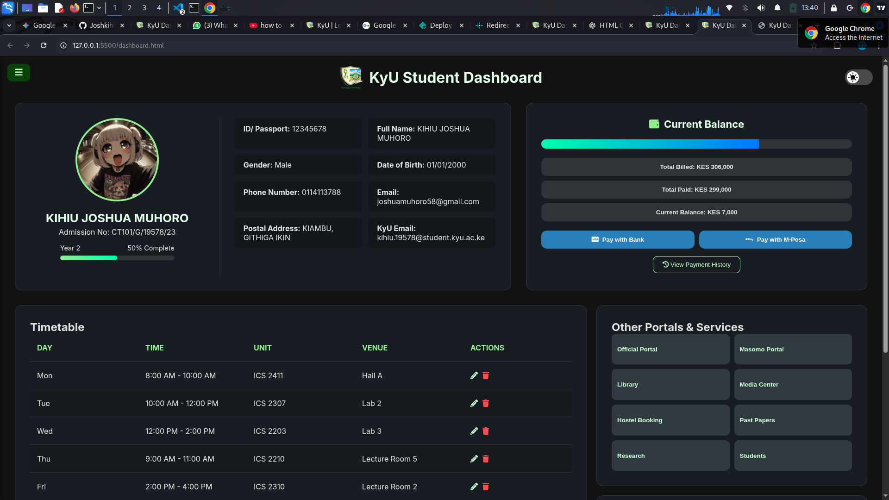

# KyU Student Dashboard - Upgraded Version

## 📖 Introduction

This project is a modern, upgraded version of a student dashboard for **Kirinyaga University (KyU)**. It was built from the ground up to provide a clean, responsive, and user-friendly interface for students to manage their academic and financial information. This version replaces the older, less intuitive portal with a sleek, feature-rich design that works seamlessly across all devices.

## ✨ Key Features

* **Fully Responsive Design**: The layout fluidly adapts to any screen size, offering a perfect experience on desktops, tablets, and mobile phones.
* **Interactive Timetable**: Students can view, edit, and manage their weekly schedule directly on the dashboard. New classes can be added, and existing ones can be updated or deleted on the fly.
* **Modern Opaque Theme**: A visually appealing dark theme with high-contrast elements and vibrant accents for better readability and a professional look.
* **Dynamic Widgets**: Quick access to other university portals, services, and real-time notifications.
* **Comprehensive Student Sections**: Easy navigation to view fee statements, payment receipts, academic results, register units, and manage account settings like changing passwords.
* **Client-Side Functionality**: Built entirely with HTML, CSS, and vanilla JavaScript. It's lightweight, fast, and requires no complex backend setup to run.

## 💻 Technology Stack

* **HTML5**: For the core structure and content of the dashboard.
* **CSS3**: For all styling, including the responsive layout, custom theme variables, and animations.
* **Vanilla JavaScript**: For all interactive elements, including the sidebar navigation, timetable management, theme switching, and form validation.
* **Font Awesome**: For a clean and consistent icon set used throughout the application.

## 📸 Screenshots

*Insert screenshots of the dashboard here to showcase the design and features.*

**Dashboard View:**


<!-- **Mobile View:** -->

## 🚀 Setup and Usage

To run this project on your local machine, follow these steps:

1.  **Clone the repository:**
    ```bash
    git clone [[https://your-repository-url-here.git](https://your-repository-url-here.git)]
    ```
    (Replace `[https://your-repository-url-here.git]` with the actual URL of your Git repository.)

2.  **Navigate to the project directory:**
    ```bash
    cd [repository-folder-name]
    ```

3.  **Open the `index.html` file:**
    Simply open the `index.html` file in any modern web browser (like Chrome, Firefox, or Edge).

That's it! The dashboard is fully functional locally and requires no server.

## 🤝 Contributing

Contributions are welcome! If you have suggestions for improvements or want to fix a bug, please feel free to:

1.  Fork the Project
2.  Create your Feature Branch (`git checkout -b feature/AmazingFeature`)
3.  Commit your Changes (`git commit -m 'Add some AmazingFeature'`)
4.  Push to the Branch (`git push origin feature/AmazingFeature`)
5.  Open a Pull Request
